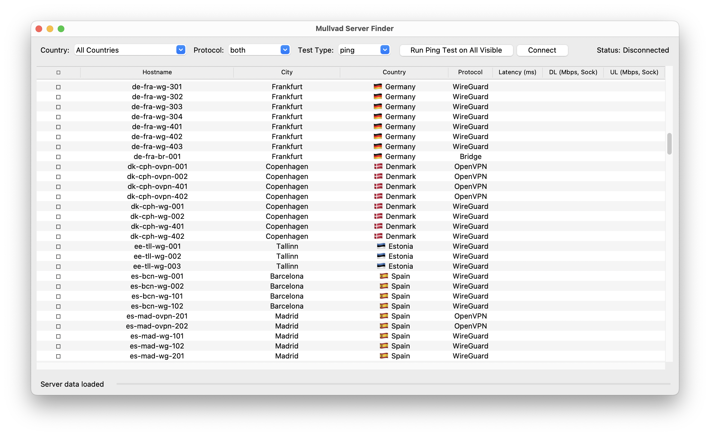

# Mullvad Server Finder

A Python GUI application to help identify the best Mullvad VPN servers based on latency and estimated socket performance. Retrieve server listings, perform tests, filter, sort, and connect to optimal servers.



## Key Features

- **Server Discovery**: Automatically fetches the complete Mullvad server list
- **Performance Testing**: Runs ICMP ping tests for latency and a TCP socket ping-pong test for estimated connection responsiveness/throughput.
- **Smart Filtering**: Filter servers by country and protocol (WireGuard, OpenVPN, or Both).
- **Flexible Connection**: Connect to selected servers (single or fastest) directly via the Mullvad CLI. Double-click to connect.
- **Favorites System**: Save preferred servers for quick access
- **Customizable Settings**: Configure testing parameters, appearance, and behavior

## System Requirements

- Python 3.7 or newer (due to potential type hinting usage)
- Tkinter (usually included with Python)
- Mullvad VPN desktop client installed and properly configured
- `mullvad` command-line tool accessible in your system PATH
- `sv-ttk` library for improved theming (optional, but recommended)

## Installation

1. Clone this repository:
   ```
   git clone https://github.com/Lichiel/Mullvad-Server-Finder.git
   cd mullvad-server-finder
   ```

2. (Optional) Create a virtual environment:
   ```
   python -m venv venv
   source venv/bin/activate  # On Windows: venv\Scripts\activate
   ```

3. Install dependencies (sv-ttk is recommended for better visuals):
   ```
   pip install sv-ttk
   ```

## Usage Guide

### Starting the Application

Launch the application by running:
```
python main.py
```

### Filtering and Selecting Servers

1. Use the **Country** dropdown to filter servers by location (includes flags!). Select "All Countries" to see the full list.
2. Select your preferred **Protocol** (WireGuard, OpenVPN, or Both) to further filter the list.
3. Choose the **Test Type** (ping, speed, or both) you intend to run from the dropdown. This also updates the main test button's text.
4. **Checkboxes**: Click the checkbox in the header row to select/deselect all visible servers. Click individual checkboxes next to server hostnames to select specific servers for testing or connection.

### Testing Server Performance

1. Click the main **Run Test** button. The button text indicates whether it will test "All Visible" servers or the specific number of "Selected" servers (based on checkboxes).
2. The application will perform the selected test type (ping, speed, or both) on the target servers. Progress is shown in the status bar. You can Pause or Stop the test using the buttons that appear.
3. Results (Latency, Download/Upload Speed) appear in the list. Lower latency is generally better. Higher socket speed *might* indicate a more responsive connection for certain types of traffic but is not a guarantee of real-world speed.
4. Results are color-coded (optional, configurable in Settings) for easier visual comparison. Green indicates better performance within the tested set.
5. Click column headers to sort the results.

### Connecting to Servers

- **Select** a server in the list.
- Click the **Connect** button or use the **Connection -> Connect to Selected** menu item (Ctrl+C).
- Alternatively, **double-click** a server row to connect.
- Use **Connection -> Connect to Fastest** to automatically select and connect to the server with the lowest ping result from the last test run.
- Enable **Auto-Connect** in Settings to automatically connect to the fastest server after a ping test completes.
- Use **Connection -> Disconnect** (Ctrl+D) to disconnect.

### Managing Favorites

- Add frequently used servers to your favorites list for quick access
- Manage favorites through the Favorites menu

## Configuration

Access the **Settings** dialog through the **File** menu to customize:

- **General**:
    - **Cache Path**: Specify the location of Mullvad's `relays.json` file. Defaults to `~/.config/mullvad-finder/relays.json` if not set.
    - **Auto Connect**: Enable/disable connecting to the fastest server automatically after ping tests.
    - **Theme**: Choose between Light, Dark, or System theme (requires `sv-ttk`).
    - **Alternating Row Colors**: Toggle background colors for rows in the list.
- **Testing**:
    - **Ping Count**: Number of pings per server.
    - **Max Workers**: Number of servers to test concurrently.
    - **Test Timeout**: Timeout for ping tests.
    - **Color Latency/Speed**: Enable/disable color-coding for result cells.
    - **Speed Test Duration**: How long the socket speed test runs for each server (in seconds).
    - **Default Test Type**: Set the default test selected on startup.
- **Display**:
    - **Default Sort Column/Order**: Set how the list is sorted initially.

## Troubleshooting

### Common Issues

- **Mullvad CLI Not Found / Dependency Error**: Ensure the Mullvad VPN client is installed correctly and the `mullvad` command works in your terminal. The application relies on the CLI for status checks and connection management.
- **Cannot Find `relays.json` / Error Loading Data**:
    - The application first looks for a `relays.json` file specified in **Settings -> General -> Cache Path**.
    - If that's empty or invalid, it looks for `relays.json` inside a configuration directory: `~/.config/mullvad-finder/relays.json` (on Linux/macOS) or `%APPDATA%\mullvad-finder\relays.json` (on Windows).
    - If still not found, it attempts to locate the default Mullvad cache path (e.g., `/Library/Caches/mullvad-vpn/relays.json` on macOS, `%PROGRAMDATA%\Mullvad VPN\cache\relays.json` on Windows, `~/.cache/mullvad-vpn/relays.json` on Linux).
    - **Solution**: Manually copy the `relays.json` file from the Mullvad cache location to `~/.config/mullvad-finder/` (or the Windows equivalent) OR explicitly set the correct path in the application's Settings.
- **Connection Failures**: Besides ensuring the Mullvad client is running, check the Mullvad app's logs for connection errors. This tool simply tells the Mullvad CLI what to do.
- **Slow Testing**: Reduce **Max Workers** in Settings if testing consumes too many resources.
- **Speed Test Results are 0 or Low**: The socket speed test uses direct TCP connections to common ports. Some servers might block or throttle these non-standard connections, leading to low or zero results. This test is primarily for *relative comparison* between servers under these specific conditions, not an absolute measure of browsing/download speed.

## Project Structure

- `main.py`: Application entry point, sets up logging and environment.
- `gui.py`: Defines the main Tkinter GUI application class and its components.
- `server_manager.py`: Contains logic for fetching, filtering, and testing servers (ping and socket speed test).
- `mullvad_api.py`: Wraps Mullvad CLI commands for status, connection, etc.
- `config.py`: Handles loading, saving, and managing user settings and cache/log paths.

## License

This project is licensed under the MIT License - see the LICENSE file for details.

## Acknowledgments

- [Mullvad VPN](https://mullvad.net/) for their excellent privacy-focused VPN service.
- The [sv-ttk](https://github.com/rdbende/Sun-Valley-ttk-theme) project for the modern Tkinter theme.
- The Python standard library (Tkinter, logging, threading, etc.).
